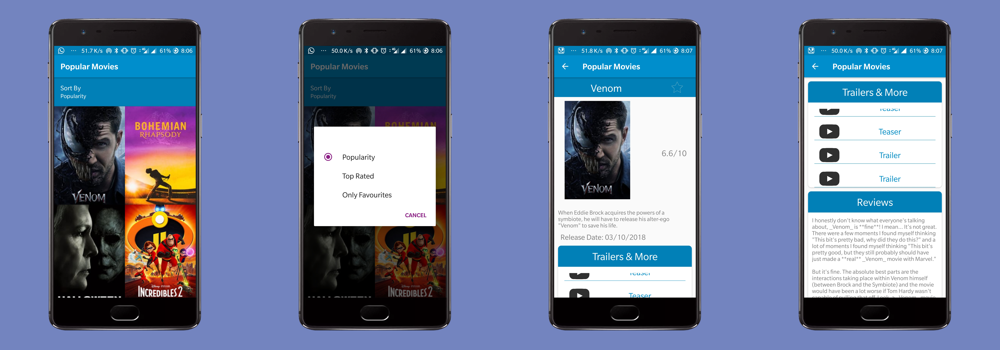

# PopularMovies

<b>Features</b>:
<ul>
<li>Displays all the latest and greatest movies in a GridView</li>
<li>Displays ratings and links to the trailers of the movie along with reviews</li>
<li>Ability to save favourite movie details for offline viewing</li>
  <li>Uses Picasso library</li>
  <li>Sort movies by popularity or ratings</li>
</ul> 
<b>Important:</b> 
Please  Add your Api key for TMDB in the strings.xml file before running the app.
This app makes use of Android Views like RecyclerView, GridView and Used Room To store Movies data Offline and diplay it to user.

